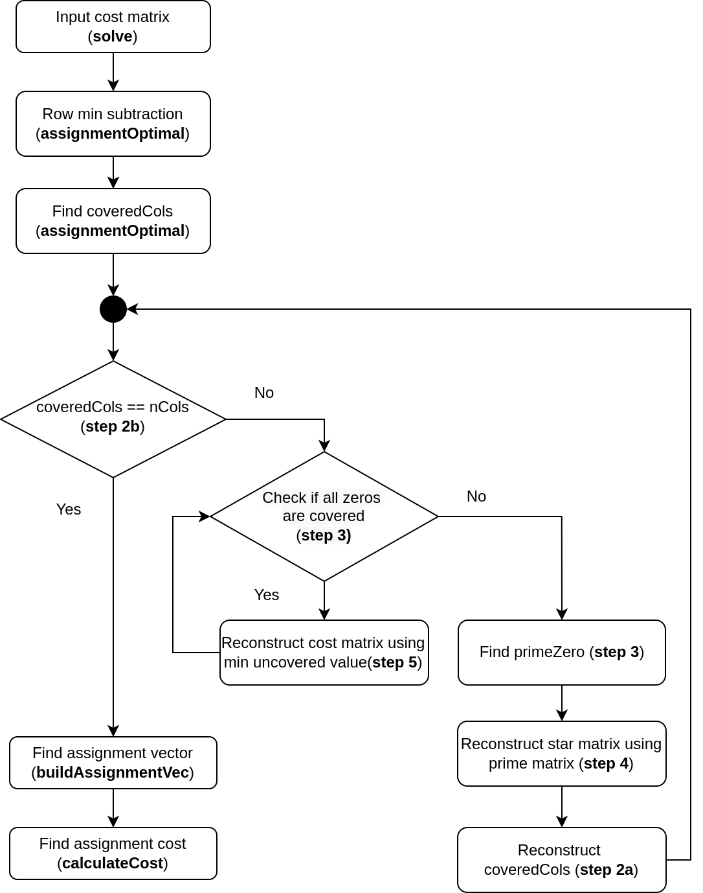

# hungarianAlgorithm
- Repo contains C++ implementation of the famous Hungarian algorithm
- The Hungarian algorithm solves the optimal assignment problem in polynomial time ~O(n<sup>3</sup>)

- Eg : If the Cost of doing work for different workers can be tabulated as follows : 

| Worker / Task      | Task 1 | Task2 | Task3 | Task4 |
| -------------------| -------| ------| ------| ------|
| Worker A           | 5      | 9     | 3     | 6     |
| Worker B           | 8      | 7     | 8     | 2     |
| Worker C           | 6      | 10    | 12    | 7     |
| Worker D           | 3      | 10    | 8     | 6     |

- The optimal assignment for the above is 
    - Worker A -> Task 3
    - Worker B -> Task 4
    - Worker C -> Task 2
    - Worker D -> Task 1
- Total Optimal cost = 3 + 2 + 10 +3 = 18

- The implementation is forked from the [wonderful repo](https://github.com/mcximing/hungarian-algorithm-cpp) but has been improved upon by
    - Using `Eigen` library for array operations
    - Added docstring and flowchart for better understanding of implementation

- Theoretically, it solves the primal-dual optimization problem. [Reference : NPTEL operations research course](https://www.youtube.com/watch?v=BUGIhEecipE)
)


### Algorithm workflow



### Requirements
The code was developed on Ubuntu 20.04 LTS OS with
- g++ 9.4.0
- cmake 3.16.3
- Eigen 3.3


### How to run the project
```
$ git clone https://github.com/suryajayaraman/hungarianAlgorithm.git
$ cd hungarianAlgorithm
$ mkdir -p build && cd build
$ cmake ..
$ make
```


### Applications of Hungarian algorithm

- It is used for solving **Data association problem in Object Tracking Applications** as explained in this [blog post](https://www.thinkautonomous.ai/blog/?p=hungarian-algorithm)


[Image reference](https://www.thinkautonomous.ai/blog/?p=hungarian-algorithm)


- It's also one of the foundations for Algorithms like [`SORT (Simple Online and Realtime tracking)`](https://arxiv.org/pdf/1602.00763.pdf)


### References
- [thinkautonomous blog post](https://www.thinkautonomous.ai/blog/?p=hungarian-algorithm)
- [wiki page](https://en.wikipedia.org/wiki/Hungarian_algorithm)
- [Markus Buehren inspired c++ implementation](https://github.com/mcximing/hungarian-algorithm-cpp)
- [Python implementation](https://python.plainenglish.io/hungarian-algorithm-introduction-python-implementation-93e7c0890e15)
- [C implementation with explanation](https://brc2.com/the-algorithm-workshop/)
- [c++ implementation](https://github.com/saebyn/munkres-cpp)